# 设计可扩展的便携式Docker容器网络

## What You Will Learn

Docker容器将软件包装在一个完整的文件系统中，该文件系统包含运行所需的一切：
code，runtime，系统工具，系统库 - 可以安装在服务器上的任何东西。 
这可以保证软件总是一致的运行，无论其环境如何。 
默认情况下，容器将应用程序彼此隔离，并将底层基础架构隔离，同时为应用程序提供额外的保护层.

## Prerequisites

* [Docker 概念(concepts)](https://docs.docker.com/engine/understanding-docker/)
* [Docker Swarm and Swarm mode concepts](https://docs.docker.com/engine/swarm/key-concepts/#/services-and-tasks)

## 容器网络和微服务的挑战

微服务实践增加了应用程序的规模，这更加重视提供给应用程序的连接和隔离方法。 
Docker网络理念是应用驱动的。 它旨在为网络运营商提供选项和灵活性，
并为应用程序开发人员提供正确的抽象级别。

与任何设计一样，网络设计也是一种平衡行为。 **Docker EE**和Docker生态系统为网络工程师提供了多种工具，
以实现其应用程序和环境的最佳平衡。 每个选项都提供不同的好处和权衡。 
本指南的其余部分详细介绍了这些选择，以便网络工程师可以了解哪些选择最适合他们的环境。

Docker开发了一种新的应用程序交付方式，通过这种方式，容器也改变了网络接入方式的某些方面。 
以下主题是容器化应用程序的常见设计主题：

* 可移植性
    * 如何利用独特的网络特性保证跨多种网络环境的最大可移植性？
* 服务发现
    * 我如何知道服务在扩展和缩小时，服务运行的位置？
* 负载均衡  
    * 当服务创建和扩展时，如何在服务之间共享负载？
* 安全
    * 如何进行分段以防止错误的容器相互访问？
    * 如何保证具有应用程序和群集控制流量的容器是安全的？
* 性能  
    * 如何在最小化延迟和最大化带宽的同时提供高级网络服务？
* 可扩展性  
    * 在跨多个主机扩展应用程序时，如何确保不会牺牲这些特性？

## 容器网络模型(The Container Networking Model，以下简称CNM)

Docker网络架构构建在一组称为容器网络模型（CNM）的接口上。 CNM的理念是为各种基础设施提供应用程序可移植性。
该模型在实现应用程序可移植性方面取得了平衡，并且还利用了基础结构的特殊功能。

## 容器网络模型构造设计(CNM Constructs)

CNM中有几个高级构造。它们都是操作系统和基础架构无关的，因此无论基础架构堆栈如何，应用程序都可以获得统一的体验。

* 沙箱(Sandbox) - 沙箱包含容器网络堆栈的配置。这包括管理容器的接口，路由表和DNS设置。 Sandbox的实现可以是Linux Network Namespace，FreeBSD Jail或其他类似的概念。沙箱可能包含来自多个网络的许多端点。
* 端点(Endpoint) - 端点将沙箱连接到网络。端点构造存在，因此可以从应用程序中抽象出与网络的实际连接。这有助于保持可移植性，以便服务可以使用不同类型的网络驱动程序，而无需关心它如何连接到该网络。
* 网络(Network) -  CNM未根据OSI模型指定网络。网络的实现可以是Linux网桥，VLAN等。网络是端点的集合，它们之间具有连接。未连接到网络的端点在网络上没有连通。

## CNM驱动程序接口
容器网络模型提供两个可插入和开放的接口，供用户，社区和供应商使用，以利用网络中的其他功能，可见性或控制。
   
存在以下网络驱动：
   
* 网络drivers -  Docker网络drivers提供使网络正常工作的实际实现。它们是可插拔的，因此可以使用不同的drivers并轻松互换以支持不同的用例。可以在给定的Docker Engine或集群上同时使用多个网络驱动程序，但每个Docker网络仅通过单个网络driver进行实例化。有两种类型的CNM网络drivers：
    * 本机网络drivers - 本机网络drivers是Docker Engine的一部分，由Docker提供。有多种drivers可供选择，支持不同的功能，如overlay或本地bridge。
    * 远程网络drivers - 远程网络drivers是社区和其他供应商创建的网络驱动程序。这些drivers可用于提供与现有软件和硬件的集成。用户还可以在需要现有网络driver不支持的特定功能的情况下创建自己的drivers。
* IPAM驱动 -  Docker具有本机IP地址管理driver，如果未指定，则为网络和端点提供默认子网或IP地址。也可以通过网络，容器和服务创建命令手动分配IP寻址。远程IPAM驱动程序也存在，并提供与现有IPAM工具的集成。

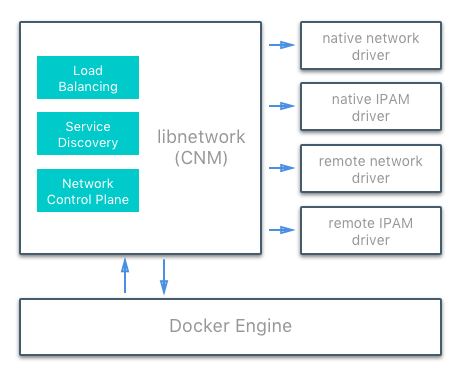

## Docker原生网络驱动程序
   Docker本机网络drivers是Docker Engine的一部分，不需要任何额外的模块。 它们通过标准`docker network`命令调用和使用。 存在以下本机网络drivers。
   
|驱动程序|说明|
|-------|------|
|Host | 通过`host` driver，容器可以使用主机的网络堆栈。没有namespace隔离，主机上的所有接口都可以由容器直接使用 |
|Bridge | `bridge` driver在Docker管理的主机上创建Linux bridge。默认情况下，网桥上的容器可以相互通信。也可以通过`bridge` driver配置外部对容器的访问 |
|Overlay | `overlay` driver创建一个分层网络，支持开箱即用的多主机网络。它结合使用本地Linux网桥和VXLAN，通过物理网络基础架构覆盖容器到容器的通信 |
|MACVLAN | `macvlan` driver使用MACVLAN桥接模式在容器接口和父主机接口（或子接口）之间建立连接。它可用于为可在物理网络上路由的容器提供IP地址。此外，可以将VLAN中继到`macvlan` driver以强制执行2层容器分段 |
|None | `none`驱动程序为容器提供自己的网络堆栈和网络命名空间，但不配置容器内的接口。如果没有其他配置，容器将与主机网络堆栈完全隔离 |

## 网络范围
如`docker network ls`输出所示，Docker网络driver具有范围概念。 网络范围是驱动程序的域，可以是`local`或`swarm`范围。 `local`范围的driver在主机范围内提供连接和网络服务（如DNS或IPAM）。 `swarm`范围的driver提供跨群集群集的连接和网络服务。 `swarm`范围的网络在整个群集中具有相同的网络ID，而`local`范围的网络在每个主机上具有唯一的网络ID。
 
    $ docker network ls
    NETWORK ID          NAME                DRIVER              SCOPE
    1475f03fbecb        bridge              bridge              local
    e2d8a4bd86cb        docker_gwbridge     bridge              local
    407c477060e7        host                host                local
    f4zr3zrswlyg        ingress             overlay             swarm
    c97909a4b198        none                null                local

## Docker远程网络驱动
以下社区和供应商创建的远程网络驱动程序与CNM兼容。 每个都为容器提供独特的功能和网络服务。

|Driver|	Description|
|-------|------|
|[contiv](http://contiv.github.io/)	| 由Cisco Systems领导的开源网络插件，为多租户微服务部署提供基础架构和安全策略。 Contiv还为非容器工作负载和物理网络（如ACI）提供集成。 Contiv实现远程网络和IPAM驱动程序。|
|[weave](https://www.weave.works/docs/net/latest/introducing-weave/)	| 一个网络插件，用于创建跨多个主机或云连接Docker容器的虚拟网络。 Weave提供应用程序的自动发现，可以在部分连接的网络上运行，不需要外部群集存储，并且操作友好。 |
|[calico](https://www.projectcalico.org/)	| 云数据中心虚拟网络的开源解决方案。 它面向数据中心，大多数工作负载（虚拟机，容器或裸机服务器）只需要IP连接。 Calico使用标准IP路由提供此连接。 工作负载之间的隔离 - 无论是根据租户所有权还是任何更细粒度的策略 - 都是通过托管源和目标工作负载的服务器上的iptables编程实现的。|
|[kuryr](https://github.com/openstack/kuryr)	| 作为OpenStack Kuryr项目的一部分开发的网络插件。 它通过利用OpenStack网络服务Neutron实现Docker网络（libnetwork）远程驱动程序API。 Kuryr还包括一个IPAM驱动程序。 |

## Docker远程IPAM驱动程序
社区和供应商创建的IPAM驱动程序还可用于提供与现有系统或特殊功能的集成。

|Driver | Description|
|-------|------|
|infoblox |	一个开源IPAM插件，提供与现有Infoblox工具的集成。 |

>存在许多Docker插件，并且一直在创建更多插件。 Docker维护着一个[最常见的插件列表](https://docs.docker.com/engine/extend/legacy_plugins/).

## Linux网络基础知识
Linux内核具有非常成熟和高性能的TCP/IP堆栈实现（除了DNS和VXLAN等其他本机内核功能）。 Docker网络使用内核的网络堆栈作为低级原语来创建更高级别的网络driver。 简而言之，Docker网络就是Linux网络。

现有Linux内核功能的这种实现确保了高性能和健壮性。 最重要的是，它提供了跨许多发行版和版本的可移植性，从而增强了应用程序的可移植性。

Docker使用几个Linux网络构建块来实现其本机CNM网络driver。 此列表包括Linux网桥，网络命名空间，veth对和iptables。 这些工具的组合（作为网络驱动程序实现）为复杂的网络策略提供转发规则，网络分段和管理工具。

## Linux Bridge
Linux网桥是第2层设备，它是Linux内核中物理交换机的虚拟实现。它根据通过检查流量动态学习的MAC地址转发流量。 Linux桥接器广泛用于许多Docker网络驱动程序中。 Linux桥不应与桥接器Docker网络驱动程序混淆，后者是Linux桥接器的更高级别实现。
    
## 网络命名空间
Linux网络命名空间是内核中的隔离网络堆栈，具有自己的接口，路由和防火墙规则。它是容器和Linux的安全方面，用于隔离容器。在网络术语中，它们类似于VRF，它将主机内的网络控制和数据平面分段。网络命名空间确保同一主机上的两个容器无法相互通信，甚至无法与主机本身通信，除非通过Docker网络进行配置。通常，CNM网络驱动程序为每个容器实现单独的命名空间。但是，容器可以共享相同的网络命名空间，甚至可以是主机网络命名空间的一部分。主机网络命名空间容纳主机接口和主机路由表。此网络命名空间称为全局网络命名空间。

##  虚拟以太网设备
虚拟以太网设备或veth是Linux网络接口，充当两个网络命名空间之间的连接线。 veth是一个全双工链接，每个命名空间中都有一个接口。一个接口中的流量被引导出另一个接口。 Docker网络驱动程序利用veths在创建Docker网络时提供名称空间之间的显式连接。当容器连接到Docker网络时，veth的一端放在容器内（通常被视为ethX接口），而另一端连接到Docker网络。
    
## iptables的
iptables是本机包过滤系统，自2.4版本以来一直是Linux内核的一部分。它是一个功能丰富的L3 / L4防火墙，为数据包标记，伪装和丢弃提供规则链。本机Docker网络驱动程序广泛使用iptables来分割网络流量，提供主机端口映射，并标记流量以实现负载平衡决策。
    
## Docker网络控制平面
除了传播控制平面数据之外，Docker分布式网络控制平面还管理Swarm范围的Docker网络的状态。它是Docker Swarm集群的内置功能，不需要任何额外的组件，如外部KV存储。控制平面使用基于SWIM的Gossip协议在Docker容器集群中传播网络状态信息和拓扑。 Gossip协议非常有效地实现了集群内的最终一致性，同时保持了非常大规模集群中消息大小，故障检测时间和收敛时间的恒定速率。这可确保网络能够跨多个节点进行扩展，而不会引入缩放问题，例如收敛缓慢或误报节点故障。
    
控制平面非常安全，通过加密通道提供机密性，完整性和身份验证。它也是每个网络的范围，大大减少了任何给定主机收到的更新。

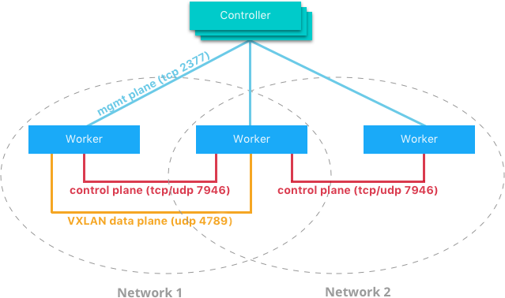

它由多个组件组成，这些组件协同工作以实现跨大规模网络的快速收敛。控制平面的分布式特性可确保群集控制器故障不会影响网络性能。

Docker网络控制平面组件如下：

* 消息传播以对等方式更新节点，将每次交换中的信息扇出到更大的节点组。固定的对等组间隔和大小确保即使群集的大小扩展，网络使用也是不变的。跨对等体的指数信息传播确保了收敛速度快，并且跨越任何簇大小。
* 故障检测利用直接和间接问候消息来排除网络拥塞和特定路径导致误报节点故障。
* 定期发生完全状态同步以更快地实现一致性并解析网络分区。
* 拓扑感知算法了解自身与其他对等体之间的相对延迟。这用于优化对等组，使收敛更快，更高效。
* 控制平面加密可以防止中间人和其他可能危及网络安全的攻击。

> Docker网络控制平面是Swarm的一个组件，需要一个Swarm集群才能运行。

## Docker主机网络驱动程序
主机网络驱动程序对于Docker的新用户来说是最熟悉的，因为它与Linux在没有Docker时使用的网络配置相同。 --net = host有效地关闭了Docker网络，容器使用主机操作系统的主机（或默认）网络堆栈。
   
通常使用其他网络驱动程序，每个容器都放在其自己的网络命名空间（或沙箱）中，以提供彼此完全的网络隔离。使用主机驱动程序容器都在同一主机网络命名空间中，并使用主机的网络接口和IP堆栈。主机网络中的所有容器都能够在主机接口上相互通信。从网络角度来看，这相当于在没有容器的主机上运行的多个进程。因为它们使用相同的主机接口，所以没有两个容器能够绑定到同一个TCP端口。如果在同一主机上安排多个容器，这可能会导致端口争用。

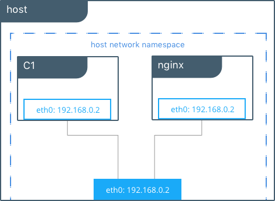

    #Create containers on the host network
    $ docker run -itd --net host --name C1 alpine sh
    $ docker run -itd --net host --name nginx
    
    #Show host eth0
    $ ip add | grep eth0
    2: eth0: <BROADCAST,MULTICAST,UP,LOWER_UP> mtu 9001 qdisc mq state UP group default qlen 1000
        inet 172.31.21.213/20 brd 172.31.31.255 scope global eth0
    
    #Show eth0 from C1
    $ docker run -it --net host --name C1 alpine ip add | grep eth0
    2: eth0: <BROADCAST,MULTICAST,UP,LOWER_UP> mtu 9001 qdisc mq state UP qlen 1000
        inet 172.31.21.213/20 brd 172.31.31.255 scope global eth0
    
    #Contact the nginx container through localhost on C1
    $ curl localhost
    !DOCTYPE html>
    <html>
    <head>
    <title>Welcome to nginx!</title>
    ...
 
在此示例中，当容器使用主机网络时，主机C1和nginx都共享eth0的相同接口。这使得主机不适合多租户或高度安全的应用程序。主机容器可以访问主机上的每个其他容器。使用localhost在容器之间进行通信是可能的，如示例中所示，当从C1执行curl nginx时。

使用主机驱动程序，Docker不管理容器网络堆栈的任何部分，例如端口映射或路由规则。这意味着像-p和--icc这样的常见网络标志对主机驱动程序没有任何意义。他们被忽略了。这确实使主机网络成为网络驱动程序的最简单和最低延迟。流量路径直接从容器进程流向主机接口，提供裸机性能，相当于非容器化流程。

完全主机访问和无自动策略管理可能使主机驱动程序难以作为通用网络驱动程序。但是，主机确实有一些有趣的属性，可能适用于超高性能应用程序或应用程序故障排除等用例。

## Docker Bridge网络驱动程序
本节介绍默认的Docker桥接网络以及用户定义的桥接网络。
   
## 默认的Docker Bridge网络
在任何运行Docker Engine的主机上，默认情况下都有一个名为bridge的本地Docker网络。 此网络使用桥接网络驱动程序创建，该驱动程序实例化名为docker0的Linux网桥。 这听起来可能令人困惑。
   
   * bridge是Docker网络的名称
   * bridge是从中创建此网络的网络驱动程序或模板
   * docker0是Linux网桥的名称，它是用于实现此网络的内核构建块
在独立的Docker主机上，如果未指定其他网络，则bridge是容器连接的默认网络。 在以下示例中，创建了一个没有网络参数的容器。 Docker Engine默认将其连接到网桥。 在容器内部，注意由桥驱动程序创建的eth0，并由Docker本机IPAM驱动程序给出一个地址。

    #Create a busybox container named "c1" and show its IP addresses
    host $ docker run -it --name c1 busybox sh
    c1 # ip address
    4: eth0@if5: <BROADCAST,MULTICAST,UP,LOWER_UP,M-DOWN> mtu 1500 qdisc noqueue
        link/ether 02:42:ac:11:00:02 brd ff:ff:ff:ff:ff:ff
        inet 172.17.0.2/16 scope global eth0
    ...
    
> 容器接口的MAC地址是动态生成的，并嵌入IP地址以避免冲突。 这里ac：11：00：02对应于172.17.0.2。

主机上的工具brctl显示主机网络命名空间中存在的Linux网桥。 它显示了一个名为docker0的网桥。 docker0有一个接口vetha3788c4，它提供从网桥到容器c1内的eth0接口的连接。

    host $ brctl show
    bridge name      bridge id            STP enabled    interfaces
    docker0          8000.0242504b5200    no             vethb64e8b8
    

在容器c1内部，容器路由表将流量引导到容器的eth0，从而引导docker0桥。

    c1# ip route
    default via 172.17.0.1 dev eth0
    172.17.0.0/16 dev eth0  src 172.17.0.2

容器可以具有零到多个接口，具体取决于它连接的网络数量。 每个Docker网络每个容器只能有一个接口。

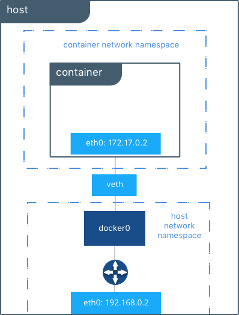

如主机路由表中所示，全局网络命名空间中的IP接口现在包括docker0。 主机路由表提供了外部网络上docker0和eth0之间的连接，完成了从容器内部到外部网络的路径。

    host $ ip route
    default via 172.31.16.1 dev eth0
    172.17.0.0/16 dev docker0  proto kernel  scope link  src 172.17.42.1
    172.31.16.0/20 dev eth0  proto kernel  scope link  src 172.31.16.102

默认情况下，桥接器从范围172分配一个子网。[17-31] .0.0 / 16或192.168。[0-240] .0 / 20，它与任何现有主机接口不重叠。 默认桥接网络也可以配置为使用用户提供的地址范围。 此外，现有的Linux网桥可用于桥接网络，而不是Docker创建一个。 有关自定义桥的更多信息，请转至Docker Engine文档。

> 默认网桥是唯一支持传统链路的网络。 默认桥接网络不支持基于名称的服务发现和用户提供的IP地址。

## 用户定义的网桥
除了默认网络，用户还可以创建自己的网络，称为任何网络驱动程序类型的用户定义网络。 在用户定义的桥接网络的情况下，在主机上设置新的Linux桥接器。 与默认桥接网络不同，用户定义的网络支持手动IP地址和子网分配。 如果未给出赋值，则Docker的默认IPAM驱动程序将分配私有IP空间中可用的下一个子网。

在用户定义的桥接网络下面创建了两个连接到它的容器。 指定了子网，网络名为my_bridge。 一个容器未获得IP参数，因此IPAM驱动程序会为其分配子网中的下一个可用IP。 另一个容器已指定IP。

    $ docker network create -d bridge --subnet 10.0.0.0/24 my_bridge
    $ docker run -itd --name c2 --net my_bridge busybox sh
    $ docker run -itd --name c3 --net my_bridge --ip 10.0.0.254 busybox sh
    
brctl现在显示主机上的第二个Linux桥接器。 Linux桥的名称br-4bcc22f5e5b9与my_bridge网络的网络ID匹配。 my_bridge还有两个连接到容器c2和c3的veth接口。

    $ brctl show
    bridge name      bridge id            STP enabled    interfaces
    br-b5db4578d8c9  8000.02428d936bb1    no             vethc9b3282
                                                         vethf3ba8b5
    docker0          8000.0242504b5200    no             vethb64e8b8
    
    $ docker network ls
    NETWORK ID          NAME                DRIVER              SCOPE
    b5db4578d8c9        my_bridge           bridge              local
    e1cac9da3116        bridge              bridge              local
    ...

列出全局网络命名空间接口显示已由Docker Engine实例化的Linux网络电路。 每个veth和Linux桥接接口都显示为其中一个Linux网桥和容器网络命名空间之间的链接。

    $ ip link
    
    1: lo: <LOOPBACK,UP,LOWER_UP> mtu 65536
    2: eth0: <BROADCAST,MULTICAST,UP,LOWER_UP> mtu 9001
    3: docker0: <BROADCAST,MULTICAST,UP,LOWER_UP> mtu 1500
    5: vethb64e8b8@if4: <BROADCAST,MULTICAST,UP,LOWER_UP> mtu 1500
    6: br-b5db4578d8c9: <BROADCAST,MULTICAST,UP,LOWER_UP> mtu 1500
    8: vethc9b3282@if7: <BROADCAST,MULTICAST,UP,LOWER_UP> mtu 1500
    10: vethf3ba8b5@if9: <BROADCAST,MULTICAST,UP,LOWER_UP> mtu 1500
    ...
    
## 独立容器的外部访问
默认情况下，同一个Docker网络上的所有容器（多主机群范围或本地范围）在所有端口上都具有相互连接。不同Docker网络之间的通信以及源自Docker外部的容器入口流量都是防火墙。这是一个基本的安全方面，可以保护容器应用程序免受外部世界的影响。这在Network Security中有更详细的概述
   
对于大多数类型的Docker网络（包括桥接和覆盖），必须明确授予应用程序的外部入口访问权限。这是通过内部端口映射完成的。 Docker将主机接口上公开的端口发布到内部容器接口。下图描绘了到容器C2的入口（底部箭头）和出口（顶部箭头）流量。默认情况下允许出站（出口）容器流量。由容器启动的出口连接被伪装/ SNAT到短暂端口（通常在32768到60999的范围内）。允许此连接上的返回流量，因此容器使用临时端口上主机的最佳可路由IP地址。
   
Ingress访问是通过显式端口发布提供的。端口发布由Docker Engine完成，可以通过UCP或Engine CLI进行控制。可以将特定或随机选择的端口配置为公开服务或容器。可以将端口设置为侦听特定（或所有）主机接口，并将所有流量从此端口映射到容器内的端口和接口。

    $ docker run -d --name C2 --net my_bridge -p 5000:80 nginx

使用Docker CLI或UCP中的--publish / -p配置外部访问。 运行上述命令后，该图显示容器C2已连接到my_bridge网络，其IP地址为10.0.0.2。 容器在主机接口192.168.0.2的端口5000上向外界通告其服务。 进入此接口的所有流量：端口是发布到容器接口的10.0.0.2:80的端口。

由容器启动的出站流量被伪装，以便它来自主机接口192.168.0.2上的短暂端口32768。 返回流量使用相同的IP地址和端口作为其目标，并在内部伪装回容器地址：端口10.0.0.2:33920。 使用端口发布时，网络上的外部流量始终使用主机IP和公开端口，而不使用容器IP和内部端口。

有关在Docker引擎群集中公开容器和服务的信息，请阅读[Swarm服务的外部访问](https://success.docker.com/api/asset/.%2Frefarch%2Fnetworking%2F#swarm-external)。

## Overlay驱动程序网络架构
原生Docker Overlay网络驱动程序从根本上简化了多主机网络中的许多挑战。 使用覆盖驱动程序，多主机网络是Docker中的一流公民，无需外部配置或组件。 overlay使用Swarm分布式控制平面在非常大规模的集群中提供集中管理，稳定性和安全性。
   
## VXLAN数据平面
覆盖驱动程序使用行业标准的VXLAN数据平面，将容器网络与底层物理网络（底层）分离。 Docker覆盖网络将容器流量封装在VXLAN标头中，允许流量穿过物理第2层或第3层网络。 无论底层物理拓扑如何，覆盖使网络分段动态且易于控制。 使用标准IETF VXLAN标头可促进标准工具检查和分析网络流量。

> 自3.7版本以来，VXLAN一直是Linux内核的一部分，而Docker使用内核的本机VXLAN功能来创建覆盖网络。 Docker覆盖数据路径完全在内核空间中。 这样可以减少上下文切换，减少CPU开销，并在应用程序和物理NIC之间实现低延迟，直接的流量路径。

 
IETF VXLAN（[RFC 7348](https://datatracker.ietf.org/doc/rfc7348/)）是一种数据层封装格式，它通过第3层网络覆盖第2层网段。 VXLAN旨在用于标准IP网络，可支持共享物理网络基础架构上的大规模多租户设计。 现有的内部部署和基于云的网络可以透明地支持VXLAN。

VXLAN定义为MAC-in-UDP封装，将容器第2层帧放置在底层IP / UDP头中。 底层IP / UDP报头提供底层网络上主机之间的传输。 覆盖是无状态VXLAN隧道，其作为参与给定覆盖网络的每个主机之间的点对多点连接而存在。 由于覆盖层独立于底层拓扑，因此应用程序变得更加便携。 因此，无论是在本地，在开发人员桌面上还是在公共云中，都可以与应用程序一起传输网络策略和连接。
  

在此图中，显示了覆盖网络上的数据包流。以下是c1在其共享覆盖网络上发送c2数据包时发生的步骤：

* c1对c2进行DNS查找。由于两个容器位于同一个覆盖网络上，因此Docker Engine本地DNS服务器将c2解析为其覆盖IP地址10.0.0.3。
* overlay网络是L2段，因此c1生成以c2的MAC地址为目的地的L2帧。
* 该帧由覆盖网络驱动程序用VXLAN头封装。分布式覆盖控制平面管理每个VXLAN隧道端点的位置和状态，因此它知道c2驻留在物理地址192.168.0.3的主机-B上。该地址成为底层IP头的目标地址。
* 封装后，数据包将被发送。物理网络负责将VXLAN数据包路由或桥接到正确的主机。
* 数据包到达主机-B的eth0接口，并由覆盖网络驱动程序解封装。来自c1的原始L2帧被传递到c2的eth0接口，直到侦听应用程序。

## Overlay驱动程序内部架构
Docker Swarm控制平面可自动完成覆盖网络的所有配置。 不需要VXLAN配置或Linux网络配置。 数据平面加密是叠加的可选功能，也可以在创建网络时由覆盖驱动程序自动配置。 用户或网络运营商只需定义网络（docker network create -d overlay ...）并将容器附加到该网络。

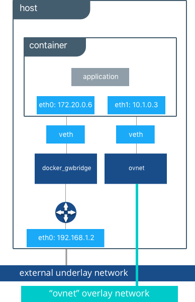

在Overlay网络创建期间，Docker Engine会在每台主机上创建覆盖所需的网络基础架构。 每个覆盖创建一个Linux桥及其关联的VXLAN接口。 仅当在主机上安排连接到该网络的容器时，Docker Engine才会智能地在主机上实例化覆盖网络。 这可以防止不存在连接容器的覆盖网络蔓延。

以下示例创建一个覆盖网络，并将容器附加到该网络。 Docker Swarm / UCP自动创建覆盖网络。 以下示例需要预先设置Swarm或UCP。

    #Create an overlay named "ovnet" with the overlay driver
    $ docker network create -d overlay --subnet 10.1.0.0/24 ovnet
    
    #Create a service from an nginx image and connect it to the "ovnet" overlay network
    $ docker service create --network ovnet nginx

创建Overlay网络时，请注意在主机内部创建了多个接口和网桥，以及此容器内的两个接口。

    # Peek into the container of this service to see its internal interfaces
    conatiner$ ip address
    
    #docker_gwbridge network
    52: eth0@if55: <BROADCAST,MULTICAST,UP,LOWER_UP> mtu 1500
        link/ether 02:42:ac:14:00:06 brd ff:ff:ff:ff:ff:ff
        inet 172.20.0.6/16 scope global eth1
           valid_lft forever preferred_lft forever
        inet6 fe80::42:acff:fe14:6/64 scope link
           valid_lft forever preferred_lft forever
    
    #overlay network interface
    54: eth1@if53: <BROADCAST,MULTICAST,UP,LOWER_UP> mtu 1450
        link/ether 02:42:0a:01:00:03 brd ff:ff:ff:ff:ff:ff
        inet 10.1.0.3/24 scope global eth0
           valid_lft forever preferred_lft forever
        inet 10.1.0.2/32 scope global eth0
           valid_lft forever preferred_lft forever
        inet6 fe80::42:aff:fe01:3/64 scope link
           valid_lft forever preferred_lft forever
 
 在容器内部创建了两个接口，这两个接口对应于主机上现在存在的两个网桥。 在覆盖网络上，每个容器至少有两个接口，分别将它连接到覆盖层和docker_gwbridge。

|Bridge	 |Purpose|
|-------|------|
|overlay | The ingress and egress point to the overlay network that VXLAN encapsulates and (optionally) encrypts traffic going between containers on the same overlay network. It extends the overlay across all hosts participating in this particular overlay. One existd per overlay subnet on a host, and it has the same name that a particular overlay network is given. |
|docker_gwbridge | The egress bridge for traffic leaving the cluster. Only one docker_gwbridge exists per host. Container-to-Container traffic is blocked on this bridge allowing ingress/egress traffic flows only. |

> Docker Overlay驱动程序自Docker Engine 1.9以来就已存在，并且需要外部K / V存储来管理网络状态。 Docker Engine 1.12将控制平面状态集成到Docker Engine中，因此不再需要外部存储。 1.12还引入了一些新功能，包括加密和服务负载平衡。 引入的网络功能需要支持它们的Docker Engine版本，并且不支持将这些功能与旧版本的Docker Engine一起使用。

## Docker服务的外部访问
Swarm和UCP提供对群集端口发布之外的服务的访问。 服务的入口和出口不依赖于集中式网关，而是依赖于运行特定服务任务的主机上的分布式入口/出口。 服务，主机模式和入口模式有两种端口发布模式。
   
## 入口模式服务发布
入口模式端口发布利用Swarm Routing Mesh在服务中的任务之间应用负载平衡。 入口模式在每个UCP / Swarm节点上发布暴露的端口。 到发布端口的入口流量由路由网格负载平衡，并通过循环负载平衡定向到服务的健康任务之一。 即使给定主机未运行服务任务，端口也会在主机上发布，并对具有任务的主机进行负载平衡。

    $ docker service create --replicas 2 --publish mode=ingress,target=80,published=8080 nginx
    
 > mode = ingress是服务的默认模式。 此命令也可以使用速记版本-p 80：8080来完成。 端口8080在群集上的每个主机上公开，并在此服务中对两个容器进行负载平衡。
 
## 主机模式服务发布
主机模式端口发布仅在运行特定服务任务的主机上公开端口。 端口直接映射到该主机上的容器。 每个主机上只能运行给定服务的单个任务以防止端口冲突。

    $ docker service create --replicas 2 --publish mode=host,target=80,published=8080 nginx
    
> 主机模式需要mode = host标志。 它在运行这两个容器的主机上本地发布端口8080。 它不应用负载平衡，因此到这些节点的流量仅指向本地容器。 如果没有足够的端口可用于副本数量，则可能导致端口冲突。

## 入口设计(ingress design)
发布模式有很多好的用例。 入口模式适用于具有多个副本并需要在这些副本之间进行负载平衡的服务。 如果其他工具已提供外部服务发现，则主机模式可以正常工作。 主机模式的另一个好用例是每个主机存在一次的全局容器。 这些容器可能会公开与本主机相关的特定信息（例如监视或日志记录），因此您不希望在访问该服务时进行负载平衡。

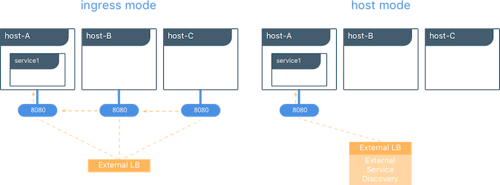

## MACVLAN
macvlan驱动程序是经过验证的真正网络虚拟化技术的新实现。 Linux实现非常轻量级，因为它们不是使用Linux网桥进行隔离，而是简单地与Linux以太网接口或子接口相关联，以强制实现网络之间的分离以及与物理网络的连接。
   
MACVLAN提供许多独特的功能。由于具有非常简单和轻量级的架构，它具有积极的性能影响。 MACVLAN驱动程序不是端口映射，而是提供容器和物理网络之间的直接访问。它还允许容器接收物理网络子网上的可路由IP地址。
   
MACVLAN用例可能包括：
   
   * 极低延迟的应用程序
   * 网络设计要求容器与外部主机网络在同一子网上并使用IP
   
macvlan驱动程序使用父接口的概念。此接口可以是物理接口，例如eth0，用于802.1q VLAN标记的子接口，如eth0.10（.10表示VLAN 10），或者甚至是绑定的主机适配器，它将两个以太网接口捆绑到一个逻辑接口中。

在MACVLAN网络配置期间需要网关地址。网关必须位于网络基础架构提供的主机外部。 MACVLAN网络允许在同一网络上的容器之间进行访问。如果没有在主机外部路由，则无法在同一主机上的不同MACVLAN网络之间进行访问。
   
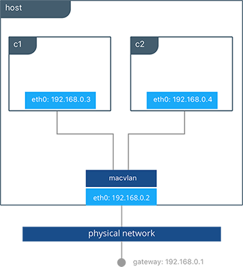

此示例将MACVLAN网络绑定到主机上的eth0。 它还将两个容器连接到mvnet MACVLAN网络，并显示它们可以在它们之间进行ping操作。 每个容器在192.168.0.0/24物理网络子网上都有一个地址，其默认网关是物理网络中的接口。

    #Creation of MACVLAN network "mvnet" bound to eth0 on the host
    $ docker network create -d macvlan --subnet 192.168.0.0/24 --gateway 192.168.0.1 -o parent=eth0 mvnet
    
    #Creation of containers on the "mvnet" network
    $ docker run -itd --name c1 --net mvnet --ip 192.168.0.3 busybox sh
    $ docker run -it --name c2 --net mvnet --ip 192.168.0.4 busybox sh
    / # ping 192.168.0.3
    PING 127.0.0.1 (127.0.0.1): 56 data bytes
    64 bytes from 127.0.0.1: icmp_seq=0 ttl=64 time=0.052 ms
    

正如您在此图中所见，c1和c2通过MACVLAN网络连接，该网络名为macvlan，连接到主机上的eth0。

## 使用MACVLAN进行VLAN中继
对于许多运营商而言，将CPU 802.1q中继到Linux主机是非常痛苦的。 它需要更改配置文件才能在重新启动时保持持久性。 如果涉及网桥，则需要将物理网卡移入网桥，然后网桥获取IP地址。 macvlan驱动程序通过创建，销毁和主机重新启动来完全管理MACVLAN网络的子接口和其他组件。

当使用子接口实例化macvlan驱动程序时，它允许VLAN中继到主机并在L2处分段容器。 macvlan驱动程序自动创建子接口并将它们连接到容器接口。 因此，每个容器都位于不同的VLAN中，除非在物理网络中路由流量，否则它们之间无法进行通信。

    #Creation of  macvlan10 network in VLAN 10
    $ docker network create -d macvlan --subnet 192.168.10.0/24 --gateway 192.168.10.1 -o parent=eth0.10 macvlan10
    
    #Creation of  macvlan20 network in VLAN 20
    $ docker network create -d macvlan --subnet 192.168.20.0/24 --gateway 192.168.20.1 -o parent=eth0.20 macvlan20
    
    #Creation of containers on separate MACVLAN networks
    $ docker run -itd --name c1--net macvlan10 --ip 192.168.10.2 busybox sh
    $ docker run -it --name c2--net macvlan20 --ip 192.168.20.2 busybox sh
    

在上面的配置中，我们使用macvlan驱动程序创建了两个独立的网络，这些驱动程序配置为使用子接口作为其父接口。 macvlan驱动程序创建子接口并在主机的eth0和容器接口之间连接它们。 必须将主机接口和上游交换机设置为switchport mode trunk，以便在接口上标记VLAN。 可以将一个或多个容器连接到给定的MACVLAN网络，以创建通过L2分段的复杂网络策略。

> 由于多个MAC地址位于单个主机接口后面，因此您可能需要在接口上启用混杂模式，具体取决于NIC对MAC过滤的支持。

## 无（隔离）网络驱动程序
与host网络驱动程序类似，none网络驱动程序本质上是一种非托管网络选项。 Docker Engine不会在容器内创建接口，建立端口映射或安装连接路由。 使用--net = none的容器与其他容器和主机完全隔离。 网络管理员或外部工具必须负责提供此管道。 使用none的容器只有一个loopback接口而没有其他接口。
   
与host驱动程序不同，none驱动程序为每个容器创建单独的命名空间。 这可以保证任何容器和主机之间的容器网络隔离。

> 使用--net = none或--net = host的容器无法连接到任何其他Docker网络。

## 物理网络设计要求
Docker EE和Docker网络旨在运行在通用数据中心网络基础架构和拓扑上。其集中控制器和容错集群可确保在各种网络环境中兼容。提供网络功能的组件（网络配置，MAC学习，覆盖加密）要么是Docker Engine，UCP的一部分，要么是Linux内核本身。运行任何本机Docker网络驱动程序都不需要额外的组件或特殊网络功能。
   
更具体地说，Docker本机网络驱动程序对以下内容没有任何要求：
   
   * 组播
   * 外部键值存储
   * 具体的路由协议
   * 主机之间的第2层邻接
特定的拓扑结构，如脊柱和叶子，传统的3层和PoD设计。支持任何这些拓扑。
这与容器网络模型一致，该模型可在所有环境中提升应用程序可移植性，同时仍实现应用程序所需的性能和策略。
   
## Swarm本地服务发现
Docker使用嵌入式DNS为在单个Docker引擎上运行的容器和在Docker Swarm中运行的任务提供服务发现。 Docker Engine具有内部DNS服务器，可为用户定义的网桥，覆盖和MACVLAN网络中的主机上的所有容器提供名称解析。每个Docker容器（或Swarm模式下的任务）都有一个DNS解析器，它将DNS查询转发给Docker Engine，后者充当DNS服务器。然后，Docker Engine检查DNS查询是否属于请求容器所属的网络上的容器或服务。如果是，则Docker Engine在其键值存储中查找与容器，任务，服务名称匹配的IP地址，并将该IP或服务虚拟IP（VIP）返回给请求者。
   
服务发现是网络范围的，这意味着只有位于同一网络上的容器或任务才能使用嵌入式DNS功能。不在同一网络上的容器无法解析彼此的地址。此外，只有在特定网络上具有容器或任务的节点才会存储该网络的DNS条目。这可以提高安全性和性能。
   
如果目标容器或服务不属于与源容器相同的网络，则Docker Engine会将DNS查询转发到配置的默认DNS服务器。

在这个例子中，有两个名为myservice的容器服务。 第二个服务（客户端）存在于同一网络上。 客户端为docker.com和myservice执行两个curl操作。 这些是由此产生的结果：

* DNS查询由客户端为docker.com和myservice启动。
* 容器的内置解析器拦截127.0.0.11:53上的DNS查询，并将它们发送到Docker Engine的DNS服务器。
* myservice解析为该服务的虚拟IP（VIP），该服务在内部负载平衡到各个任务IP地址。 容器名称也会解析，尽管直接与其IP地址相关。
* docker.com不作为mynet网络中的服务名称存在，因此请求将转发到配置的默认DNS服务器。

## Docker本机负载平衡
Docker Swarm集群具有内置的内部和外部负载平衡功能，这些功能内置于引擎中。 内部负载平衡提供同一Swarm或UCP集群内容器之间的负载平衡。 外部负载平衡提供进入群集的入口流量的负载平衡。
   
## UCP内部负载平衡
创建Docker服务时，会自动实例化内部负载平衡。 在Docker Swarm集群中创建服务时，会自动为它们分配一个虚拟IP（VIP），该虚拟IP是服务网络的一部分。 解析服务名称时返回VIP。 到该VIP的流量将自动发送到覆盖网络上该服务的所有健康任务。 这种方法避免了任何客户端负载平衡，因为只有一个IP返回给客户端。 Docker负责路由并在健康的服务任务中平均分配流量。

要查看VIP，请运行docker service检查my_service，如下所示：

    # Create an overlay network called mynet
    $ docker network create -d overlay mynet
    a59umzkdj2r0ua7x8jxd84dhr
    
    # Create myservice with 2 replicas as part of that network
    $ docker service create --network mynet --name myservice --replicas 2 busybox ping localhost
    8t5r8cr0f0h6k2c3k7ih4l6f5
    
    # See the VIP that was created for that service
    $ docker service inspect myservice
    ...
    
    "VirtualIPs": [
                    {
                        "NetworkID": "a59umzkdj2r0ua7x8jxd84dhr",
                        "Addr": "10.0.0.3/24"
                    },
    ]
    
> DNS循环（DNS RR）负载平衡是服务的另一个负载平衡选项（使用--endpoint-mode配置）。 在DNS RR模式下，不为每个服务创建VIP。 Docker DNS服务器以循环方式将服务名称解析为单个容器IP。

## UCP外部L4负载平衡（Docker路由网）
在创建或更新服务时，可以使用--publish标志在外部公开服务。在Docker Swarm模式下发布端口意味着群集中的每个节点都在侦听该端口。但是，如果服务的任务不在正在侦听该端口的节点上，会发生什么？
   
这是路由网格发挥作用的地方。路由网格是Docker 1.12中的一项新功能，它结合了ipvs和iptables来创建一个功能强大的集群范围的传输层（L4）负载均衡器。它允许所有Swarm节点接受服务发布端口上的连接。当任何Swarm节点接收到发往正在运行的服务的已发布TCP / UDP端口的流量时，它会使用名为ingress的预定义覆盖网络将其转发到服务的VIP。入口网络的行为类似于其他覆盖网络，但其唯一目的是将网状路由流量从外部客户端传输到集群服务。它使用与上一节中描述的相同的基于VIP的内部负载平衡。
   
启动服务后，您可以为应用程序创建外部DNS记录，并将其映射到任何或所有Docker Swarm节点。您无需担心容器的运行位置，因为群集中的所有节点都与路由网状路由功能一样。

    #Create a service with two replicas and export port 8000 on the cluster
    $ docker service create --name app --replicas 2 --network appnet -p 8000:80 nginx
    
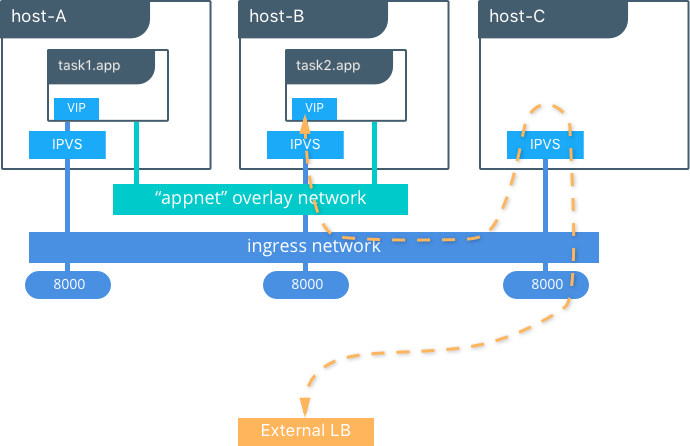

此图说明了Routing Mesh的工作原理。

* 使用两个副本创建服务，并将其外部端口映射到端口8000。
* 路由网格公开群集中每个主机上的端口8000。
* 发往应用程序的流量可以在任何主机上输入。 在这种情况下，外部LB将流量发送到没有服务副本的主机。
* 内核的IPVS负载均衡器将入口覆盖网络上的流量重定向到健康的服务副本。

## UCP外部L7负载均衡（HTTP路由网）
UCP通过HTTP Routing Mesh提供L7 HTTP / HTTPS负载均衡。 URL可以对服务进行负载平衡，并在服务副本之间进行负载平衡。
   
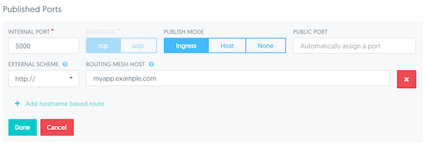

转到[UCP负载平衡参考架构](https://success.docker.com/Architecture/Docker_Reference_Architecture%3A_Universal_Control_Plane_2.0_Service_Discovery_and_Load_Balancing)了解有关UCP L7 LB设计的更多信息。

## Docker网络安全和加密
在使用Docker设计和实现容器化工作负载时，网络安全性是首要考虑因素。 在本节中，介绍了部署Docker网络时的主要安全注意事项。
   
## 网络分段和数据平面安全
Docker管理分布式防火墙规则以分割Docker网络并防止恶意访问容器资源。 默认情况下，Docker网络彼此分段以防止它们之间的流量。 这种方法在第3层提供真正的网络隔离。
   
Docker引擎管理主机防火墙规则，阻止网络之间的访问并管理暴露容器的端口。 在Swarm和UCP群集中，这会创建一个分布式防火墙，在应用程序在群集中进行调度时动态保护应用程序。
   
此表概述了Docker网络的一些访问策略。   

|Path |	Access |
|-------|------|
|Within a Docker Network | Access is permited between all containers on all ports on the same Docker network. This applies for all network types - swarm scope, local scope, built-in, and remote drivers.
|Between Docker Networks | Access is denied between Docker networks by distributed host firewall rules that are managed by the Docker engine. Containers can be attached to multiple networks to communicate between different Docker networks. Network connectivity between Docker networks can also be managed external to the host.
|Egress From Docker Network | Traffic originating from inside a Docker nework destined for outside a Docker host is permitted. The host's local, stateful firewall tracks connections to permit responses for that connection.
|Ingress to Docker Network | Ingress traffic is denied by default. Port exposure through host ports or ingress mode ports provides explicit ingress access.  An exception to this is the MACVLAN driver which operates in the same IP space as the external network and is fully open within that network. Other remote drivers that operate similarly to MACVLAN may also allow ingress traffic. |

## 控制平面安全
Docker Swarm附带集成的PKI。 Swarm中的所有管理器和节点都以签名证书的形式具有加密签名的身份。所有管理器到管理器和管理器到节点的控制通信都是通过TLS开箱即用的。无需在外部生成证书或手动设置任何CA以获得在Docker Swarm模式下保护的端到端控制平面流量。证书会定期自动轮换。
   
## 数据平面网络加密
Docker支持开箱即用的覆盖网络的IPSec加密。 Swarm和UCP管理的IPSec隧道在离开源容器时对网络流量进行加密，并在进入目标容器时对其进行解密。这可确保您的应用程序流量在传输过程中非常安全，无论底层网络如何。在混合，多租户或多云环境中，确保数据安全，因为它遍历您可能无法控制的网络，这一点至关重要。
   
此图说明了如何保护在Docker Swarm中的不同主机上运行的两个容器之间的通信。

通过添加--opt encrypted = true选项（例如docker network create -d overlay --opt encrypted = true <NETWORK_NAME>），可以在创建时为每个网络启用此功能。创建网络后，您可以在该网络上启动服务（例如，docker service create --network <NETWORK_NAME> <IMAGE> <COMMAND>）。当在两个不同的主机上创建相同服务的两个任务时，会在它们之间创建IPsec隧道，并且流量在离开源主机时会被加密，并在进入目标主机时被解密。

Swarm领导者定期重新生成对称密钥，并将其安全地分发到所有集群节点。 IPsec使用此密钥加密和解密数据平面流量。使用AES-GCM在主机到主机传输模式下通过IPSec实现加密。

## 管理平面安全和RBCP与UCP
使用UCP创建网络时，团队和标签定义对容器资源的访问。资源许可标签定义了谁可以查看，配置和使用某些Docker网络。

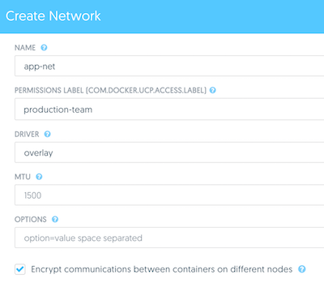

此UCP屏幕截图显示了使用标签生产团队来控制对该网络的成员的访问。 此外，可以通过UCP切换网络加密等选项。

## IP地址管理
容器网络模型（CNM）提供了如何管理IP地址的灵活性。 IP地址管理有两种方法。
    
* CNM具有本机IPAM驱动程序，可以为集群全局简单分配IP地址，并防止重叠分配。如果未指定其他驱动程序，则默认使用本机IPAM驱动程序。
* CNM具有使用来自其他供应商和社区的远程IPAM驱动程序的接口。这些驱动程序可以提供与现有供应商或自建IPAM工具的集成。
可以使用UCP，CLI或Docker API手动配置容器IP地址和网络子网。地址请求通过所选的驱动程序，然后决定如何处理请求。
    
子网大小和设计在很大程度上取决于给定的应用程序和特定的网络驱动程序。下一节将详细介绍每种网络部署模型的IP地址空间设计。端口映射，覆盖和MACVLAN的使用都会影响IP寻址的安排。通常，容器寻址分为两个桶。内部容器网络（桥接和覆盖）使用默认情况下在物理网络上无法路由的IP地址的容器进行寻址。 MACVLAN网络为物理网络子网上的容器提供IP地址。因此，来自容器接口的流量可以在物理网络上路由。值得注意的是，内部网络（网桥，覆盖）的子网不应与物理底层网络的IP空间冲突。重叠的地址空间可能导致流量无法到达目的地。
    
## 网络故障排除
对于devop和网络工程师来说，Docker网络故障排除很困难。通过正确理解Docker网络的工作原理和正确的工具集，您可以排除故障并解决这些网络问题。一种推荐的方法是使用netshoot容器来解决网络问题。 netshoot容器具有一组强大的网络故障排除工具，可用于解决Docker网络问题。
    
使用像netshoot这样的故障排除容器的强大之处在于网络故障排除工具是可移植的。 netshoot容器可以连接到任何网络，可以放在主机网络命名空间中，也可以放在另一个容器的网络命名空间中，以检查主机网络的任何视点。
    
它包含以下工具和更多：
    
* iperf
* tcpdump
* netstat
* iftop
* drill
* util-linux(nsenter)
* curl
* NMAP

## 网络部署模型
以下示例使用名为Docker Pets的虚构应用程序来说明网络部署模型。它在网页上提供宠物图像，同时计算后端数据库中页面的点击次数。
    
* web是基于chrch / docker-pets：1.0镜像的前端Web服务器
* db是一个领事后端

chrch / docker-pets需要一个环境变量DB来告诉它如何查找后端数据库服务。
    
## 单个主机上的Bridge驱动程序
此模型是本机Docker桥网络驱动程序的默认行为。网桥驱动程序在主机内部创建专用网络，并在主机接口上提供外部端口映射以进行外部连接。

    $ docker network create -d bridge petsBridge
    
    $ docker run -d --net petsBridge --name db consul
    
    $ docker run -it --env "DB=db" --net petsBridge --name web -p 8000:5000 chrch/docker-pets:1.0
    Starting web container e750c649a6b5
     * Running on http://0.0.0.0:5000/ (Press CTRL+C to quit)
     
> 如果未指定IP地址，则会在主机的所有接口上公开端口映射。 在这种情况下，容器的应用程序在0.0.0.0:8000上公开。 要提供要使用标志的特定IP地址-p IP：host_port：container_port。 可以在Docker文档中找到更多公开端口的选项。

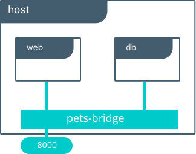

应用程序在其所有接口上的端口8000上本地公开。 还提供了DB = db，提供后端容器的名称。 Docker Engine的内置DNS将此容器名称解析为db的IP地址。 由于bridge是本地驱动程序，因此DNS解析的范围仅限于单个主机。

下面的输出向我们显示我们的容器已经从petsBridge网络的172.19.0.0/24 IP空间分配了私有IP。 如果未指定其他IPAM驱动程序，Docker将使用内置IPAM驱动程序从相应的子网提供IP。

    $ docker inspect --format {{.NetworkSettings.Networks.petsBridge.IPAddress}} web
    172.19.0.3
    
    $ docker inspect --format {{.NetworkSettings.Networks.petsBridge.IPAddress}} db
    172.19.0.2
    
这些IP地址在内部用于petsBridge网络内部的通信。 这些IP永远不会暴露在主机之外。

## 具有外部服务发现的多主机Bridge驱动程序
由于网桥驱动程序是本地范围驱动程序，因此多主机网络需要多主机服务发现解决方案。 外部SD注册容器或服务的位置和状态，然后允许其他服务发现该位置。 由于桥接驱动程序公开端口以进行外部访问，因此外部SD将host-ip：port存储为给定容器的位置。
   
在以下示例中，手动配置每个服务的位置，模拟外部服务发现。 db服务的位置通过DB环境变量传递给Web。

    #Create the backend db service and expose it on port 8500
    host-A $ docker run -d -p 8500:8500 --name db consul
    
    #Display the host IP of host-A
    host-A $ ip add show eth0 | grep inet
        inet 172.31.21.237/20 brd 172.31.31.255 scope global eth0
        inet6 fe80::4db:c8ff:fea0:b129/64 scope link
    
    #Create the frontend web service and expose it on port 8000 of host-B
    host-B $ docker run -d -p 8000:5000 -e 'DB=172.31.21.237:8500' --name web chrch/docker-pets:1.0
    
Web服务现在应该在主机-B IP地址的端口8000上提供其网页。

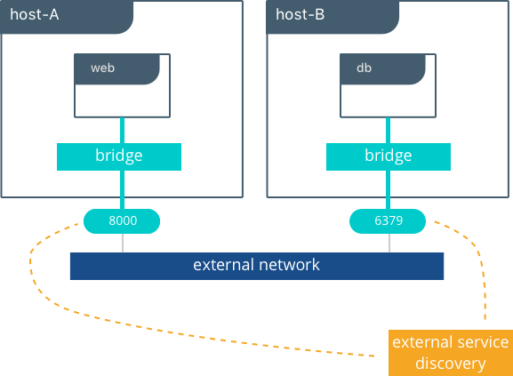

> 在此示例中，我们不指定要使用的网络，因此会自动选择默认的Docker桥接网络。

当我们在172.31.21.237:8500配置db的位置时，我们正在创建一种服务发现形式。我们静态配置Web服务的db服务的位置。在单主机示例中，这是自动完成的，因为Docker Engine为容器名称提供了内置的DNS解析。在这个多主机示例中，我们手动执行服务发现。

不建议将应用程序位置的硬编码用于生产。存在外部服务发现工具，当在集群中创建和销毁容器时，可以动态地提供这些映射。一些例子是Consul和etcd。

下一节将介绍覆盖驱动程序方案，该方案在集群中提供全局服务发现作为内置功能。与使用多个外部工具提供网络服务相反，这种简单性是覆盖驱动程序的主要优点。

## 具有Overlay驱动程序的多主机
该模型利用本机覆盖驱动程序提供开箱即用的多主机连接。覆盖驱动程序的默认设置提供与外部世界的外部连接以及容器应用程序内的内部连接和服务发现。 Overlay Driver Architecture部分将回顾Overlay驱动程序的内部结构，在阅读本节之前，您应该先查看它。

    #Display the nodes participating in this swarm cluster that was already created
    $ docker node ls
    ID                           HOSTNAME          STATUS  AVAILABILITY  MANAGER STATUS
    a8dwuh6gy5898z3yeuvxaetjo    host-B  Ready   Active
    elgt0bfuikjrntv3c33hr0752 *  host-A  Ready   Active        Leader
    
    #Create the dognet overlay network
    host-A $ docker network create -d overlay petsOverlay
    
    #Create the backend service and place it on the dognet network
    host-A $ docker service create --network petsOverlay --name db consul
    
    #Create the frontend service and expose it on port 8000 externally
    host-A $ docker service create --network petsOverlay -p 8000:5000 -e 'DB=db' --name web chrch/docker-pets:1.0
    
    host-A $ docker service ls
    ID            NAME  MODE        REPLICAS  IMAGE
    lxnjfo2dnjxq  db    replicated  1/1       consul:latest
    t222cnez6n7h  web   replicated  0/1       chrch/docker-pets:1.0
    
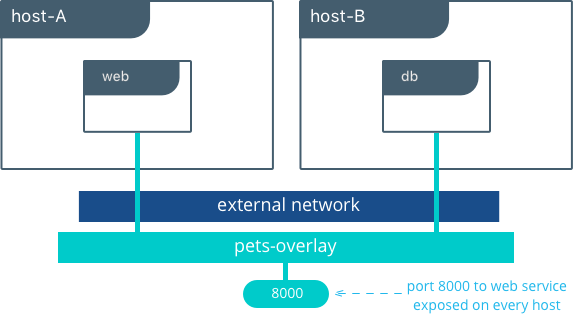

与在单主机桥示例中一样，我们将DB = db作为环境变量传递给Web服务。 覆盖驱动程序将服务名称db解析为容器的覆盖IP地址。 Web和db之间的通信仅使用覆盖IP子网进行。

> 在覆盖和桥接网络内部，所有到容器的TCP和UDP端口都是开放的，并且可以连接到覆盖网络的所有其他容器。

Web服务在端口8000上公开，路由网络在Swarm集群中的每个主机上公开端口8000。通过在浏览器中转到<host-A>：8000或<host-B>：8000来测试应用程序是否正常工作。

## Overlay的好处和用例
* 非常简单的多主机连接，适用于小型和大型部署
* 提供服务发现和负载平衡，无需额外配置或组件
* 通过加密叠加层对东西方微分段很有用
* 路由网格可用于在整个群集中通告服务

## 教程应用程序：MACVLAN桥接模式
在某些情况下，应用程序或网络环境要求容器具有可作为底层子网一部分的可路由IP地址。 MACVLAN驱动程序提供了实现此功能的实现。如MACVLAN体系结构部分所述，MACVLAN网络将自身绑定到主机接口。这可以是物理接口，逻辑子接口或绑定的逻辑接口。它充当虚拟交换机，并在同一MACVLAN网络上的容器之间提供通信。每个容器接收唯一的MAC地址和该节点所连接的物理网络的IP地址。

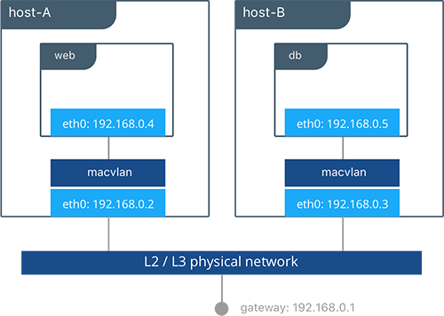

在此示例中，Pets应用程序部署在host-A和host-B上。

    #Creation of local macvlan network on both hosts
    host-A $ docker network create -d macvlan --subnet 192.168.0.0/24 --gateway 192.168.0.1 -o parent=eth0 petsMacvlan
    host-B $ docker network create -d macvlan --subnet 192.168.0.0/24 --gateway 192.168.0.1 -o parent=eth0 petsMacvlan
    
    #Creation of db container on host-B
    host-B $ docker run -d --net petsMacvlan --ip 192.168.0.5 --name db consul
    
    #Creation of web container on host-A
    host-A $ docker run -it --net petsMacvlan --ip 192.168.0.4 -e 'DB=192.168.0.5:8500' --name web chrch/docker-pets:1.0
    
这可能看起来与多主机桥示例非常相似，但有几个显着的差异：

* 从web到db的引用使用db本身的IP地址与主机IP相对。请记住，使用macvlan容器IP可以在底层网络上路由。
* 我们不公开db或web的任何端口，因为容器中打开的任何端口都可以使用容器IP地址立即访问。

虽然macvlan驱动程序提供了这些独特的优势，但它牺牲的一个领域是可移植性。 MACVLAN配置和部署与底层网络密切相关。除了防止重叠地址分配之外，容器寻址必须遵守容器放置的物理位置。因此，必须注意在MACVLAN网络外部管理IPAM。重叠IP寻址或不正确的子网可能导致容器连接丢失。

## MACVLAN的好处和用例
* 非常低延迟的应用程序可以从macvlan驱动程序中受益，因为它不使用NAT。
* MACVLAN可以为每个容器提供IP，这在某些环境中可能是必需的。
* 必须更仔细地考虑IPAM。

## 结论
Docker是一种快速发展的技术，网络选项日益增长，每天都在满足越来越多的用例。现有的网络供应商，纯粹的SDN供应商和Docker本身都是这一领域的贡献者。与物理网络的紧密集成，网络监控和加密都是备受关注和创新的领域。

本文档详述了一些但不是所有可能的部署和存在的CNM网络驱动程序。虽然有许多单独的驱动程序以及更多配置这些驱动程序的方法，但我们希望您可以看到常规部署的常用模型很少。了解每种模型的权衡取决于长期成功。